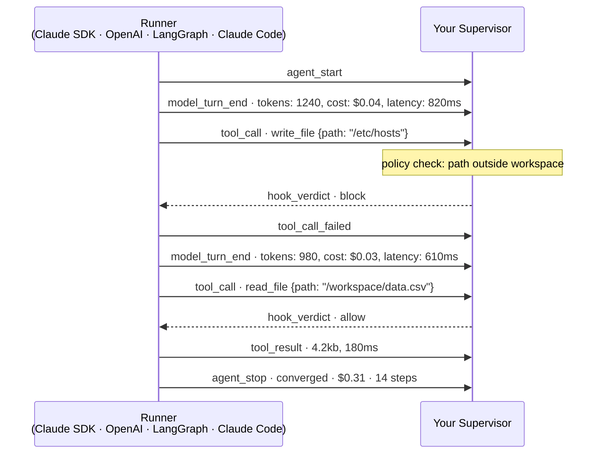
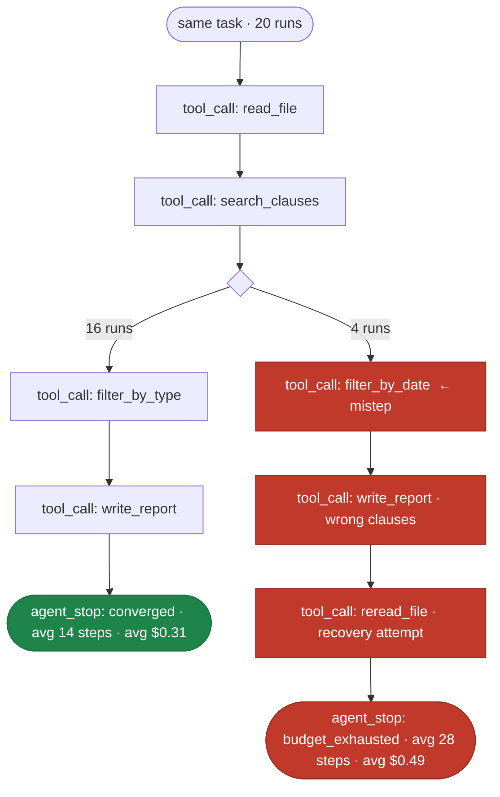

# Agent Execution Protocol (AEP)
## Partner Memo: April 2026

---

### The Problem

Every major AI provider now ships an agent SDK. OpenAI has Agents SDK. Anthropic has Claude Agent SDK. LangChain has LangGraph. Each executes agents differently, emits logs in different formats, and provides no standard way for the systems around them (orchestrators, cost monitors, compliance layers, human-in-the-loop systems) to interact with the agent at runtime.

The result is a fractured ecosystem:

- **Observability is per-SDK.** A company running multiple agent frameworks needs a separate monitoring integration for each one. Cost, tool usage, and step counts live in different schemas, different log lines, different dashboards.

- **Control is absent.** Nothing in today's frameworks allows an external system to pause agent execution mid-run, inspect a pending tool call, and approve or reject it before it fires. Business logic (policy checks, cost gates, compliance reviews) can't be wired into the agent loop without deep SDK coupling.

- **Portability is fiction.** Tools, skills, system prompts, and MCP servers have to be rewired for every runtime. The same capability written for LangChain cannot run in Goose, Codex, or a Claude agent loop without touching code and config. There is no shared surface to write to once and run anywhere.

---

### The Proposal: Agent Execution Protocol

**AEP is a minimal, open, framework-agnostic wire protocol that defines how a supervisor communicates with an agent runner.**

It draws on the lessons of OpenTelemetry (standardize the observability format so every tool works with every system), but applied to the agent execution layer itself, not just after the fact but during the run.

AEP gives you a structured event stream from any agent, plus the ability to intercept any tool call before it fires:



| Event | What it contains | What you can do |
|---|---|---|
| `model_turn_end` | tokens, cost, latency per inference | enforce budgets, alert on latency |
| `tool_call` | tool name and full inputs, before execution | pause, inspect, allow, or block |
| `tool_result` | output and duration | validate, log, audit |
| `agent_stop` | total cost, steps, stop reason | billing, SLA enforcement, diffing runs |

The same events, the same schema, whether the runner is Claude SDK, OpenAI Agents SDK, LangGraph, Claude Code, or Cursor.

AEP separates two distinct responsibilities that every agent system has, but almost none separates explicitly:

| **Supervisor** | **Runner** |
|---|---|
| Knows *what* to run, *when* to stop, *what* is allowed | Knows *how* to execute with a specific SDK |
| Owns: cost limits, policy, human review gates | Owns: model calls, tool dispatch, prompt handling |
| Implements: approval, monitoring, billing | Implements: Claude SDK, OpenAI SDK, LangGraph, etc. |

The two sides communicate over a defined wire format: the supervisor passes a config to the runner at startup; the runner emits a structured event stream back. The boundary between them is explicit, documented, and inspectable.

---

### How It Works

**Step 1: Supervisor passes config to runner**

```json
{
  "model": "anthropic/claude-sonnet-4-6",
  "prompt": "Analyze the attached contract and flag any non-standard clauses.",
  "boundary": {
    "max_cost_usd": 0.50,
    "max_steps": 30
  },
  "hooks": [
    { "event": "tool_call", "tool": "write_file", "action": "pause" }
  ]
}
```

Config is JSON passed on stdin (subprocess) or via HTTP POST (remote runner). It declares the task, hard budget limits, and any hooks, which define points where the runner should pause and wait for a supervisor verdict before continuing.

**Step 2: Runner emits a structured event stream**

```
{"type":"agent_start","run_id":"run_1a2b","model":"anthropic/claude-sonnet-4-6","ts":"2026-04-21T09:00:00Z"}
{"type":"tool_call","run_id":"run_1a2b","step":3,"call_id":"c7","tool":"read_file","input":{"path":"contract.pdf"},"ts":"..."}
{"type":"tool_result","run_id":"run_1a2b","step":3,"call_id":"c7","output":"...","duration_ms":180,"ts":"..."}
{"type":"cost_update","run_id":"run_1a2b","total_cost_usd":0.12,"ts":"..."}
{"type":"agent_stop","run_id":"run_1a2b","reason":"converged","total_cost_usd":0.31,"total_steps":14,"ts":"..."}
```

Every event is newline-delimited JSON (NDJSON), flushed immediately. The full event schema covers agent lifecycle, per-inference telemetry (tokens, cost, latency), tool call/result pairs, context compaction, skill reads, and runtime errors. A supervisor consuming this stream gets a complete, real-time view of the agent's behavior, with a consistent schema regardless of which SDK the runner uses underneath.

**Step 3: Hooks enable real-time control**

When a hook fires (e.g., "pause before any `write_file` call"), the runner halts and waits. The supervisor receives a `hook_request` event with the full tool call context, runs whatever checks it needs (policy lookup, human approval, cost gate), then writes a verdict back to the runner's stdin:

```json
{"type":"hook_verdict","call_id":"c7","action":"allow"}
```

The runner resumes. If the verdict is `"block"`, the tool call is rejected and the agent receives an error. If the agent exceeds a budget ceiling before any hook fires, the runner emits `agent_stop` with `reason: "budget_exhausted"` and exits cleanly.

---

### The Event Schema

AEP defines 16 event types covering the full agent lifecycle:

| Event | Description |
|---|---|
| `agent_start` | Run context, model, config hash, timestamp |
| `model_turn_start` / `model_turn_end` | Per-inference tokens, cost, latency |
| `tool_call` / `tool_result` / `tool_call_failed` | Tool invocation lifecycle with inputs and outputs |
| `cost_update` | Periodic budget signal (cumulative) |
| `skill_read` / `skill_execute` | Skill pack lifecycle |
| `context_compaction` | When runner compresses conversation history |
| `hook_request` / `hook_verdict_applied` | Supervisor control handshake |
| `tool_exec_request` / `tool_exec_result` | Supervisor-owned tool execution |
| `error` | Runtime errors with context |
| `agent_stop` | Final outcome: `converged`, `budget_exhausted`, `error`, `stopped` |

All events carry a `run_id`, `schema_version`, and `ts` (ISO 8601). The format is intentionally append-only and streamable: a supervisor can pipe output directly to a log aggregator, a database, or a real-time dashboard with no post-processing.

---

### Compliance

An SDK becomes AEP-compliant by satisfying 13 requirements. The core ones:

1. Read AEP config JSON from stdin before starting the agent loop
2. Emit `agent_start` as the first event with full run context
3. Emit `tool_call` before invoking any tool, `tool_result` after
4. Emit `model_turn_end` after each inference with token and cost telemetry
5. Keep stdin open when hooks are declared; block on `hook_verdict` before continuing
6. Emit `agent_stop` as the final event with outcome and totals
7. Write NDJSON to stdout only; write errors to stderr

An existing runner can be made AEP-compliant by wrapping its output. The AEP Python SDK provides dataclasses, emit helpers, and a validator (`validate(events) → Violation list`) to simplify implementation.

---

### Reference Implementation: portlang

To demonstrate AEP in a real production system, we built **portlang**, an environment-first agent execution framework that uses AEP as its internal protocol.

portlang adds the execution layer that organizations need above the agent loop itself: deterministic sandboxing (Docker/E2B), filesystem access control, re-observation (refreshing the agent's view of the environment before each step), and verifiable success criteria. It reads a declarative `.field` file:

```toml
name = "analyze-contract"

[model]
name = "anthropic/claude-sonnet-4-6"

[prompt]
goal = "Review the contract at /workspace/contract.pdf and flag non-standard clauses."
re_observation = ["ls -1 /workspace/"]

[boundary]
max_steps = 30
max_cost_usd = 0.50
allow_write = ["/workspace/output/*.md"]

[[verifier]]
type = "shell"
command = "test -f /workspace/output/report.md"
name = "report-exists"
```

portlang converts this to an AEP config, passes it to a runner (any AEP-compliant SDK), and stores the resulting event stream as a trajectory. Trajectories are replayable, diffable, and analyzable. Because every tool call, model decision, and cost signal is recorded, you can compare runs step by step — not just whether the agent succeeded, but exactly where it went wrong and why.



The mistep is not visible in a pass/fail rate. It is visible in the trajectory. Across 20 runs, the same tool call sequence diverges at step 3: the agent that filters by date instead of type produces a plausible-looking report, exhausts its budget on recovery, and fails. The path is the evaluation.

Any runner that satisfies AEP compliance can slot in.

---

### Why an Open Standard

The history of infrastructure shows a consistent pattern: when a layer of the stack becomes commodity infrastructure, the ecosystem benefits from a shared protocol rather than competing proprietary formats. TCP/IP, HTTP, OpenTelemetry. The agent execution layer is at that inflection point now.

Proprietary observability formats lock monitoring tooling to specific SDKs. Proprietary hook APIs lock policy enforcement to specific vendors. The companies that will deploy agents at scale, in regulated industries, across heterogeneous infrastructure, with real cost and compliance requirements, need the execution layer to behave like infrastructure: predictable, auditable, and independent of any single vendor.

AEP's design choices reflect this:

- **Minimal surface area.** The protocol defines only what must be shared between supervisor and runner. Sandbox design, model routing, retry logic, and prompt engineering remain entirely in the runner.

- **Transport-agnostic.** The same schema works over stdio (subprocess) and HTTP/SSE (remote runner). Moving from local to cloud execution requires no changes to the event format.

- **Append-only, streamable.** Events are designed for real-time consumption by log aggregators, monitoring systems, and billing pipelines without buffering.

- **Vendor-neutral naming.** Model identifiers use `provider/model` format (`anthropic/claude-sonnet-4-6`, `openai/gpt-4o`). The protocol has no dependency on any specific provider.

---

### Current State

| Component | Status |
|---|---|
| AEP specification (v0.2) | Complete |
| Python SDK (`agent-execution-protocol`) | Complete |
| `claude-agent-sdk-aep` runner | Complete |
| `anthropic-sdk-aep` runner | Complete |
| portlang reference implementation | In progress |
| Rust SDK | In progress |

The specification is stable at v0.2. We are seeking early partners to implement AEP-compliant runners in their SDKs and to validate the hook and event schema against real production workloads before a v1.0 release.

---

### What We're Looking For in Partners

We are looking for partners who:

- Run agents at scale and need a consistent observability layer across multiple SDKs
- Build monitoring, compliance, or orchestration tooling that would benefit from a standard event schema
- Ship an agent SDK and want to offer customers a standard interface for supervisor integration
- Are willing to provide feedback on the spec and, optionally, ship an AEP-compliant runner

In return, we offer:

- Co-authorship credit on the v1.0 specification
- Early access to the runtime and eval tooling
- Joint case studies and reference architecture documentation
- Input into the governance model for the open standard

