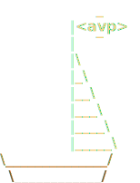

<div align="center">
  
  <h1>Agent Voyager Project (AVP)</h1>
</div>

> **Status:** Draft v0.1

AVP is an open standard for AI agents and the systems that run them. A supervisor sends a job, the agent runs it and reports back, and both sides know what to expect because both sides speak AVP.

<div align="center">
<pre>
≈≈≈≈≈≈≈≈≈≈≈≈≈≈≈≈≈≈≈≈≈≈≈≈≈≈≈≈≈≈≈≈≈≈≈≈≈≈≈≈≈≈≈≈≈≈≈≈≈≈≈≈≈≈≈≈≈≈≈≈≈≈≈≈≈≈≈≈≈≈≈≈≈≈

   I.   SUPERVISOR  ═════ Commission ══════▶  AGENT
        what to do · which model · what's available

  II.   AGENT  ◀═══ avp.resolve(ref) ═══▶  SUPERVISOR
        MCP connections · skill content · subagent commissions

 III.   AGENT  ═════ Trajectory ══════▶  SUPERVISOR
        every model + tool call · usage · outcome

≈≈≈≈≈≈≈≈≈≈≈≈≈≈≈≈≈≈≈≈≈≈≈≈≈≈≈≈≈≈≈≈≈≈≈≈≈≈≈≈≈≈≈≈≈≈≈≈≈≈≈≈≈≈≈≈≈≈≈≈≈≈≈≈≈≈≈≈≈≈≈≈≈≈
</pre>
</div>

The supervisor sends a small JSON **Commission** (what to do, which model, what resources are available); the agent runs the work and streams back a **Trajectory** of events that records every model and tool call, what the run cost, and how it ended.

AVP picks a shared vocabulary instead of inventing new wire formats: [CloudEvents](https://cloudevents.io/) for the event envelope, [OpenTelemetry](https://opentelemetry.io/) for spans and token usage, [JSON-RPC](https://www.jsonrpc.org/specification) for resource lookup, [MCP](https://modelcontextprotocol.io/) for tools, and [Agent Skills](https://agentskills.io/specification) for skill files. What AVP adds on top is small. See [FOUNDATIONS.md](FOUNDATIONS.md) for the full mapping.

Built and maintained by the [Port of Context](https://github.com/portofcontext) team.

---

## Quickstart

Set up the CLI and run your first scored agent comparison in about five minutes, on **macOS or Linux**. Each step installs only what it needs, so you reach a result before taking on the heavier (optional) agent.

### 1 · Get the CLI (and Docker)

Two prerequisites. [uv](https://github.com/astral-sh/uv) runs everything (the CLI isn't published yet, so you invoke it as `uv run avp`), and a **Docker daemon** backs the sandbox every agent run executes in — [Docker Desktop](https://docs.docker.com/desktop/), [OrbStack](https://orbstack.dev/), or [colima](https://github.com/abiosoft/colima) all work; just have one running.

```bash
curl -LsSf https://astral.sh/uv/install.sh | sh        # install uv
git clone https://github.com/portofcontext/agent-voyager-project
cd agent-voyager-project && uv sync
```

```bash
# if you don't already have a Docker daemon (pick one):
brew install --cask docker      # Docker Desktop, then launch it
brew install colima docker && colima start
```

### 2 · Install an agent

Agents are prebuilt GitHub releases, fetched over plain HTTPS (no build, no auth). `goose` needs nothing else:

```bash
uv run avp agent install goose
uv run avp agent list                                  # goose → "ready"
```

### 3 · Run an eval

The capitals example runs on Claude, so set an `ANTHROPIC_API_KEY` (or sign in with `claude login`). That's the example's choice, not a limitation: the commission picks the model, and goose runs other providers too, so you can target a different model with that provider's key.

```bash
export ANTHROPIC_API_KEY=sk-ant-...
uv run avp init capitals --agent goose
uv run avp eval run capitals.eval.json
```

The first run sets up the sandbox stack (starts the managed server, builds the
agent's image); later runs reuse all of it and start in a couple of seconds.

This runs the agent on each task and prints a **scorecard** — every commission (one agent-config variant) scored and ranked by accuracy, pass-rate, cost per run, and turns:

```
avp eval · capitals-extraction · 2 items · agent=goose
 #  commission         accuracy  pass_rate    $/run  turns/run
 1  capitals-few-shot      100%       100%  $0.0164        2.0
 2  capitals-baseline      100%       100%  $0.0166        2.0
```

`uv run avp` with no arguments shows the full command map; the complete CLI guide is in [`avp-cli/`](avp-cli/).

> **Sandboxing (always on):** every `avp eval` / `avp run` executes the agent inside an [OpenSandbox](https://github.com/opensandbox-group/OpenSandbox) container — the agent's writes stay in its workspace and its network is a default-deny egress allowlist. The one prerequisite is a running Docker daemon (Docker Desktop, OrbStack, or colima); the CLI manages the rest itself. `avp sandbox status` shows the stack.

### 4 · Add a second agent and compare (optional)

Claude Code gives you a head-to-head. It drives the `claude` CLI, so this is the one path that also needs [Node 18+](https://nodejs.org):

```bash
npm install -g @anthropic-ai/claude-code               # the claude CLI
uv run avp agent install claude-code
uv run avp init capitals --agent goose,claude-code
uv run avp eval run capitals.eval.json                 # a scorecard per agent + a head-to-head table
```

> **Verify the whole path in a throwaway container:** `make onboarding-smoke` (or `AGENT=all` for both agents) reproduces this on a clean machine, so you can confirm onboarding without touching your own setup. Add `PAID=1` (with `ANTHROPIC_API_KEY` set) to include the eval.

## Run an agent on a task, in an environment

Beyond evals, `avp` can drop an agent into a declarative **environment** (a container image plus a real codebase) and hand it a task. The environment is the agent's whole world; your machine isn't part of it.

```bash
# define an environment: a base image + a directory of code to work on
uv run avp env create myproj --image python:3.12-slim --path ./my-project

# commission an agent to do a task inside it (always sandboxed)
uv run avp run --agent goose --env myproj "Add type hints to utils.py, then run the tests"
```

Each run gets a fresh copy of the environment; `avp run` prints where the workspace landed so you can inspect what the agent changed. `--path` re-copies your source each run (skipping `.git`/`node_modules`/caches), so it's a tight curate-with-an-agent loop. `avp env run myproj -- <cmd>` runs an arbitrary command in the same environment (no agent) to see what's provisioned.

## Use AVP

- **Drop an agent into a sandboxed environment and give it a task:** `avp run --agent A --env E "<task>"` builds the env's image, seeds your code into the workspace, and runs the agent in a container. Full reference in [`avp-cli/`](avp-cli/).
- **Run an agent that emits AVP out of the box:** [`avp-claude-agent-sdk`](agents/avp-claude-agent-sdk/python/) wraps the Claude Agent SDK, which ships its own loop and tools; [`avp-goose`](agents/avp-goose/rust/) is an in-process observer of Block's Goose.
- **Build, run, and iterate on Commissions:** [`avp`](avp-cli/), the local CLI, scaffolds a Commission, runs setups (Commission variants) over a dataset against the real agents, and ranks a board by accuracy / pass-rate / cost / turns.
- **Consume a trajectory from another language:** typed bindings generated from the same JSON Schemas the Python types use, so they cannot drift: [Python](avp/bindings/python/), [Rust](avp/bindings/rust/), [TypeScript](avp/bindings/typescript/).

## Develop AVP

The core project lives under [`avp/`](avp/) (spec plus Python/Rust/TS bindings), with [`agents/`](agents/) and the local CLI [`avp-cli/`](avp-cli/) alongside. Python uses [uv](https://github.com/astral-sh/uv) with its workspace root at the repo root.

```bash
git clone https://github.com/portofcontext/agent-voyager-project
cd agent-voyager-project
make sync && make check
```

`make help` lists every target. `make check` is the free floor (format, lint, tests, conformance, bindings drift). The paid targets (`make test-real-llm`, `make conformance-check`) run against real Anthropic models and cost about $0.10 to $0.20 per run. See [CLAUDE.md](CLAUDE.md) to contribute and [`proposals/`](proposals/) for the spec RFC process.

## What AVP defines

Four specs, each adoptable on its own:

| Sub-spec | What it covers |
|---|---|
| [Trajectory](avp/core/spec/v0.1/trajectory.md) | The stream of events an agent emits as it runs. |
| [Commission](avp/core/spec/v0.1/commission.md) | The run configuration the supervisor sends at startup. |
| [Agent Descriptor](avp/core/spec/v0.1/agent-descriptor.md) | What an agent advertises about itself before a run. |
| [Resolver API](avp/core/spec/v0.1/resolver.md) | The JSON-RPC service the agent calls to look up referenced resources. |

The first three are data-shape specs; the Resolver API is the only two-party wire protocol. The umbrella [`avp/core/spec/v0.1/README.md`](avp/core/spec/v0.1/README.md) indexes all four and the shared concerns.

## More

- [PATTERNS.md](PATTERNS.md): how an application wires onto AVP, with worked examples.
- [`avp/core/conformance/`](avp/core/conformance/src/avp_conformance/cases/v0.1/): the language-agnostic suite every conforming implementation MUST pass, driven by the `avp-conformance` CLI.
- [SKILL.md](SKILL.md): a skill file for AI assistants working in this repo.

Questions or bugs: open an [issue](https://github.com/portofcontext/agent-voyager-project/issues) or use [Discussions](https://github.com/portofcontext/agent-voyager-project/discussions).
